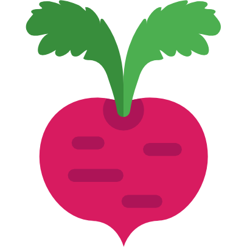

# BETTERAVE

     
<b>Betterave</b> est un site web ludique et éducatif, qui a pour but de tester et d’approfondir les connaissances de l’étudiant.  

Le jeu a pour préambule un monde d'introduction reprenant les bases de l'algorithmique. Il est divisé en différents mondes qui correspondent à différents langages de programmation. 

Dans chaque monde, le joueur incarne un personnage qu’il peut déplacer, le but étant d’atteindre la fin du niveau. Il a aussi la possibilité d’effectuer différentes actions, telles que :
<ul>
  <li>Taper du code pour pouvoir avancer à travers le monde</li>
  <li>Répondre à de courts QCM proposé par des personnages</li>
  <li>...</li>
</ul>

<h5>AUTEURS / DÉVELOPPEURS</h5>
<ul>
  <li>Quentin PÉNAULT</li>
  <li>Tanguy LEBORGNE</li>
  <li>Maxence JOLLY</li>
</ul>
